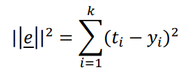
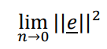

# JNeuralNetwork
Artificial Neural Network implementation in Java.

For the time being, the documentation in the source code and the program interfaces are only available in Hungarian. Translation in progress.

## Installation
The project can be build using Ant. The result will be appear in deploy directory as the name of **JArtificialNeuralNetwork.jar**.
```sh
#usage
ant all
```

## Usage

Here is an example for learning XOR function.

| A | B | y
|---|---|---
| 0 | 0 | 0
| 0 | 1 | 1
| 1 | 0 | 1
| 1 | 1 | 0

```java

    // Create Neural Network instance
    NeuralNetwork nn = NeuralNetwork.create();
    // Define input layer with two neurons and sigmoid activation
    // bias value is 1.0 with adjustable weight
    InputLayer.create().addNeuron(2, Neuron.Activation.SIGMOID, 1.0, true);
    
    // Define one hidden layer with three neurons and sigmoid activation
    // bias value is 1.0 with adjustable weight
    HiddenLayer.create().addNeuron(3, Neuron.Activation.SIGMOID, 1.0, true);
    
    // Finally define the output layer as same as before
    OutputLayer.create().addNeuron(1, Neuron.Activation.SIGMOID, 1.0, true);
    
    //Initialize the entire network weights
    nn.initWeights();

    // Create Trainer instance
    Trainer tr = new GradiantTrainer();
    
    // Add to neural network
    nn.setTrainer(tr);
    
    // Create dataset for training 
    tr.getDataSet().add(DataSet.create(new double[] {0,0},new double[] {0}));
    tr.getDataSet().add(DataSet.create(new double[] {0,1},new double[] {1}));
    tr.getDataSet().add(DataSet.create(new double[] {1,0},new double[] {1}));
    tr.getDataSet().add(DataSet.create(new double[] {1,1},new double[] {0}));

    // Set the number of Epoch
    tr.setEpoch(20000);

    // You can use condition for stop training 
    // When it reaches the specified value, it will stop regardless of the epoch number
    //tr.setShutdownCondition(0.002);

    // Set to use a gradient search brave factor default is 0.175
    tr.setBraveFactor(0.180);
    
    // Random training sequence
    tr.setRandomSequence(true);
    
    // Start Training
    tr.run();
    
    // Let's see the result
    Trace.trace("\n\nResult:");
    nn.stimulus(new double[] {0, 0});
    Trace.trace(OutputLayer.getInstance().toString());
    nn.stimulus(new double[] {0, 1});
    Trace.trace(OutputLayer.getInstance().toString());
    nn.stimulus(new double[] {1, 0});
    Trace.trace(OutputLayer.getInstance().toString());
    nn.stimulus(new double[] {1, 1});
    Trace.trace(OutputLayer.getInstance().toString());

```

### Standard Output result:
```cmd
TRACE | 2020-07-22T13:10:46.750 |Súlyok inicializálása...
TRACE | 2020-07-22T13:10:46.755 |A(z) neuralnetwork.GradiantTrainer tanító algoritmus indítása 
TRACE | 2020-07-22T13:10:46.939 |Hálózat energiája: 0.001999575240493798 
TRACE | 2020-07-22T13:10:46.940 |A hálózat elérte a leállási feltételt, ezért a tanítás leáll.
TRACE | 2020-07-22T13:10:46.940 |A(z) neuralnetwork.GradiantTrainer tanító algoritmus befejezése 
TRACE | 2020-07-22T13:10:46.940 |

Result:
TRACE | 2020-07-22T13:10:46.940 |n1=0.04473421580773881
TRACE | 2020-07-22T13:10:46.940 |n1=0.9592209122311194
TRACE | 2020-07-22T13:10:46.940 |n1=0.9592985525800726
TRACE | 2020-07-22T13:10:46.940 |n1=0.04077416674489346
```

## Notice

The network can be calculated based on the formula
energy that is probable with the shutdown criterion.



Where 𝑡̅ is the target vector and 𝑦̅ is the output vector. The shutdown condition is appropriate
to give an extremely small number because the energy of the network goes towards zero.




## Please donate free coffee here
[](https://www.paypal.me/csekme)

 
